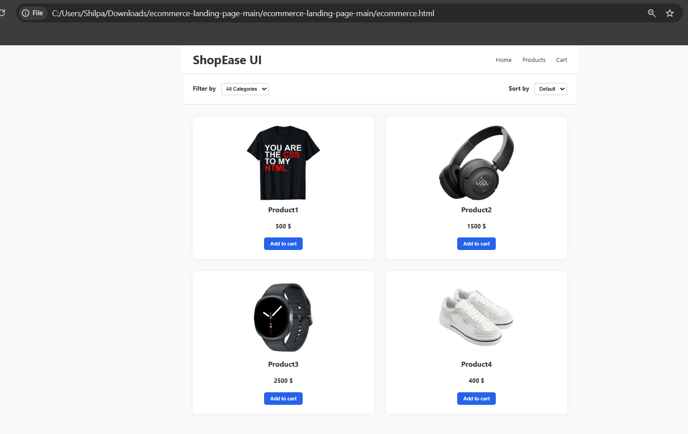

# Ecommerce Landing Page UI

This project is a simple **Ecommerce Landing Page UI** built using **HTML and CSS**.  
It displays a product grid with filtering and sorting options and clean product cards.

The goal of this project was to practice building **modern UI layouts using CSS Grid and Flexbox**.

---

## Technologies Used

- HTML5
- CSS3
- CSS Grid
- Flexbox

---

## Features

- Responsive centered layout
- Navigation bar with menu links
- Product grid layout
- Product cards with images and pricing
- Filter and Sort UI section
- Hover effects on product cards
- Styled "Add to Cart" buttons

---

## Project Preview

---

## How to Run the Project

1. Download or clone the repository
2. Open the project folder
3. Open `ecommerce.html` in your browser

The webpage will display the ecommerce landing page UI.

---

## Project Structure
